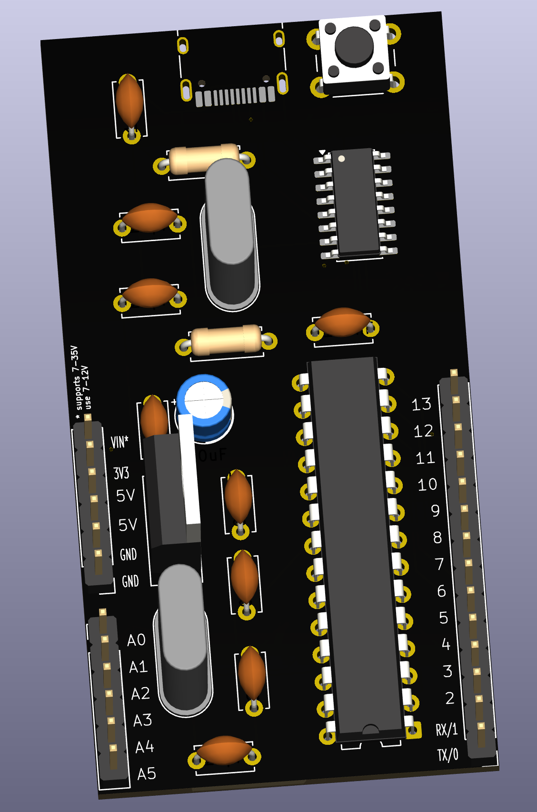
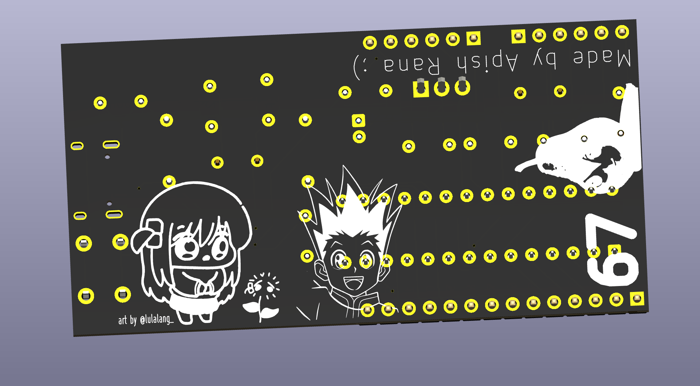
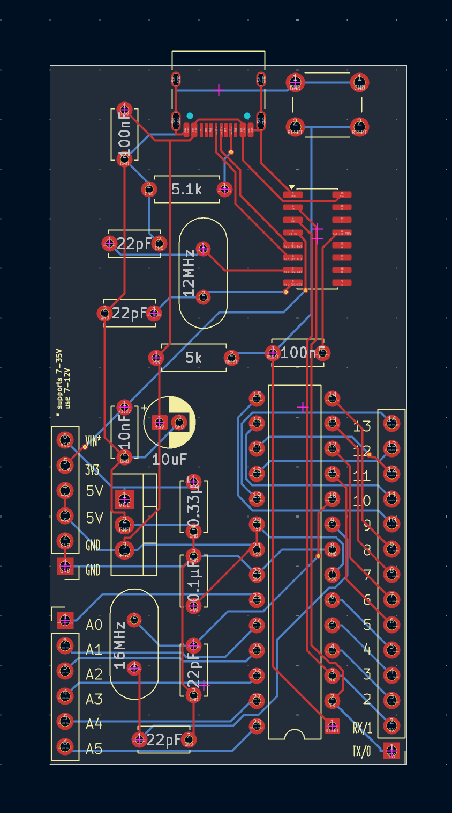
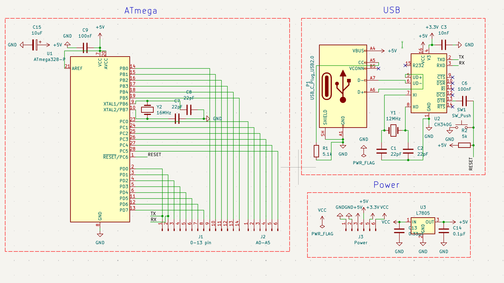

# ATmega328-P USB-C Devboard

Custom ATmega328-P-based devboard for Arduino-like systems.

## Images

### Front



### Back



### PCB



### Schematic



---

## Features

- ATmega328-P as Microcontroller
- USB-C Support
- CH340G for USB-to-Serial
- Digital Pin `0-13`
- Analog Pin `A0-A5`
- 5 V VIN Regulation with L7805
- Reset Button

---

## Repository Structure

```text
.
├── BOM.csv
├── Devboard.kicad_pcb
├── Devboard.kicad_prl
├── Devboard.kicad_pro
├── Devboard.kicad_sch
├── grbr
│   ├── Devboard-B_Cu.gbl
│   ├── Devboard-B_Mask.gbs
│   ├── Devboard-B_Paste.gbp
│   ├── Devboard-B_Silkscreen.gbo
│   ├── Devboard-Edge_Cuts.gm1
│   ├── Devboard-F_Cu.gtl
│   ├── Devboard-F_Mask.gts
│   ├── Devboard-F_Paste.gtp
│   ├── Devboard-F_Silkscreen.gto
│   ├── Devboard-job.gbrjob
│   ├── Devboard-NPTH.drl
│   ├── Devboard-PTH.drl
│   └── Devboard.zip
├── image
│   ├── back.png
│   ├── front.png
│   ├── pcb.png
│   └── schema.png
└── README.md

3 directories, 23 files
```

---

## Board Details

- Microcontroller: `ATmega328-P`
- USB Serial: `CH340G`
- Main Clock: `16 MHz`
- USB Serial Clock: `12 MHz`
- Input Power: USB-C or `VIN`

`VIN`: `7-12 V`

---

## Author

Created by [Apish Rana](https://github.com/Apishrana)
